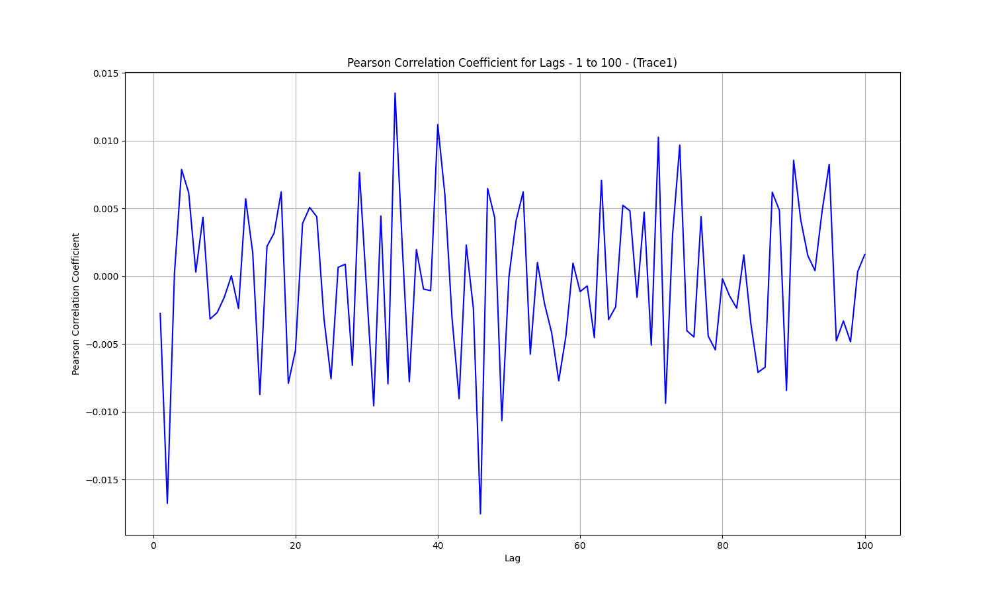
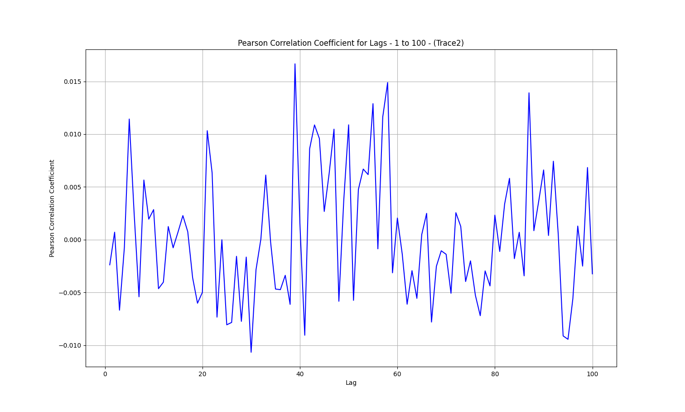
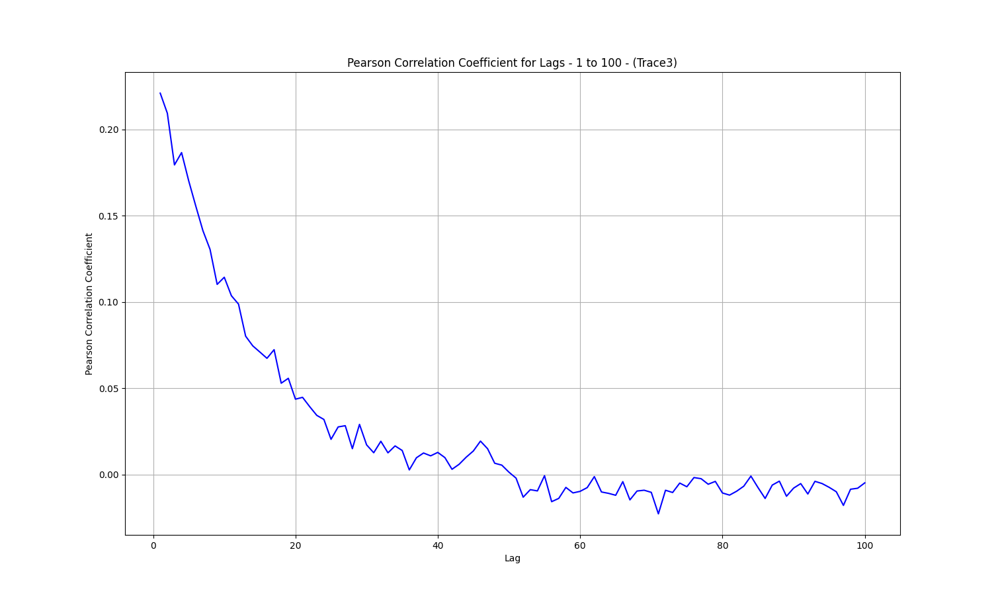
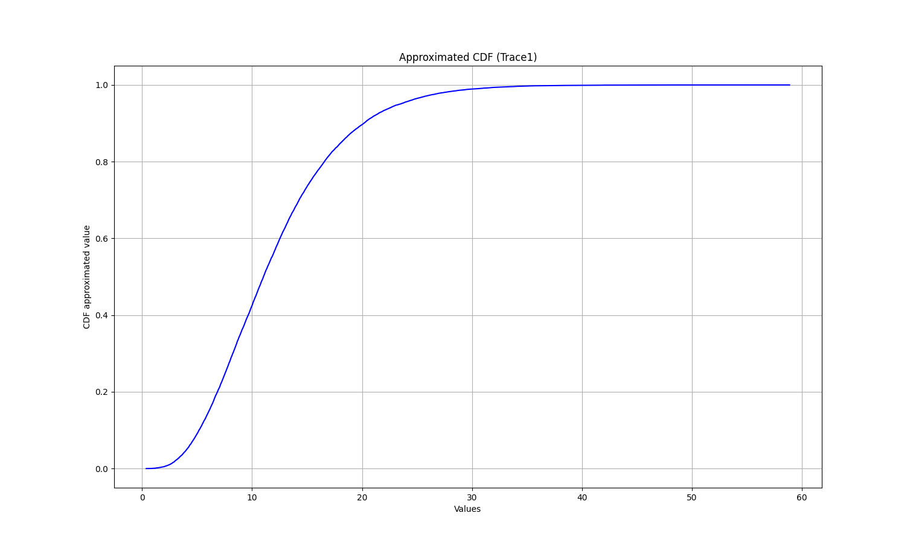
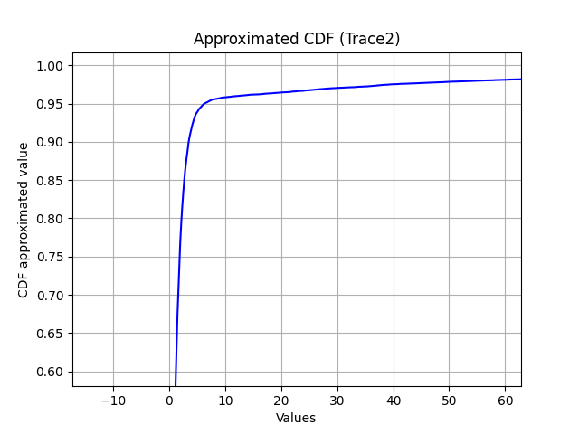
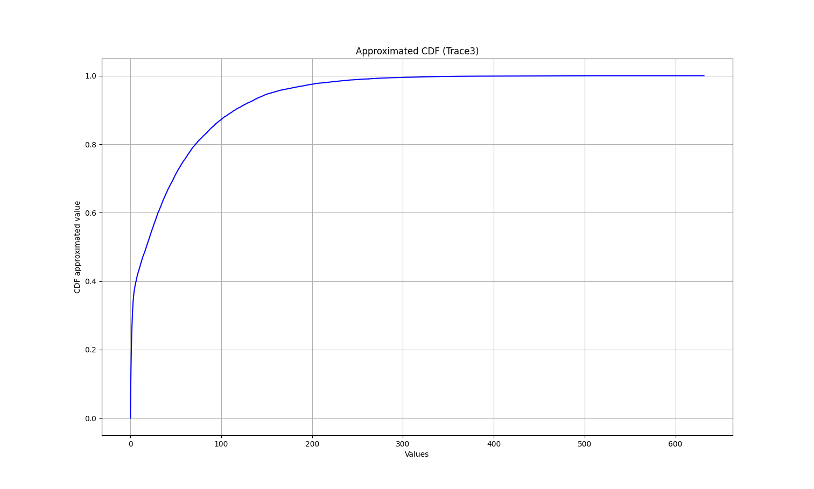

# Workload Properties
___

### Overview
The enclosed files [Trace1.csv](Trace1.csv), [Trace2.csv](Trace2.csv), and [Trace3.csv](Trace3.csv) contain a single column that reports inter-arrival times to an application server.

---

### Results

### Trace1

#### ✔️ Mean: 12.0101

#### ✔️ Second Moment: 180.8859

#### ✔️ Third Moment: 3279.8810

#### ✔️ Fourth Moment: 69730.5367

#### ✔️ Variance: 36.6434

#### ✔️ Third Central Moment: 227.2410

#### ✔️ Fourth Central Moment: 6294.6648

#### ✔️ Skewness: 1.0245

#### ✔️ Fourth Standardized Moment: 4.6879

#### ✔️ Standard Deviation: 6.0534

#### ✔️ Coefficient of Variation: 0.5040

#### ✔️ Excess Kurtosis: 1.6879

#### ✔️ 1st Quartile: 7.5693

#### ✔️ Median: 11.0380

#### ✔️ 3rd Quartile: 15.3390

#### ✔️ 5th Percentile: 4.0643

#### ✔️ 90th Percentile: 20.1622

---

### Trace2

#### ✔️ Mean: 4.2257

#### ✔️ Second Moment: 391.7368

#### ✔️ Third Moment: 71717.0252

#### ✔️ Fourth Moment: 16669846.1770

#### ✔️ Variance: 373.8800

#### ✔️ Third Central Moment: 66901.8162

#### ✔️ Fourth Central Moment: 15498632.5702

#### ✔️ Skewness: 9.2542

#### ✔️ Fourth Standardized Moment: 110.8738

#### ✔️ Standard Deviation: 19.3360

#### ✔️ Coefficient of Variation: 4.5758

#### ✔️ Excess Kurtosis: 107.8738

#### ✔️ 1st Quartile: 0.3701

#### ✔️ Median: 0.8981

#### ✔️ 3rd Quartile: 1.8704

#### ✔️ 5th Percentile: 0.0681

#### ✔️ 90th Percentile: 3.4844

---

### Trace3

#### ✔️ Mean: 40.4852

#### ✔️ Second Moment: 4863.7735

#### ✔️ Third Moment: 887560.1233

#### ✔️ Fourth Moment: 216100272.7231

#### ✔️ Variance: 3224.7230

#### ✔️ Third Central Moment: 429542.2906

#### ✔️ Fourth Central Moment: 112140478.9189

#### ✔️ Skewness: 2.3457

#### ✔️ Fourth Standardized Moment: 10.7839

#### ✔️ Standard Deviation: 56.7866

#### ✔️ Coefficient of Variation: 1.4027

#### ✔️ Excess Kurtosis: 7.7839

#### ✔️ 1st Quartile: 1.4480

#### ✔️ Median: 17.5655

#### ✔️ 3rd Quartile: 58.2640

#### ✔️ 5th Percentile: 0.1812

#### ✔️ 90th Percentile: 115.0600

---

### Graphs

#### ✔️ Pearson Correlation Coefficient for Lags m=1 to m=100

- **Trace1**
  

- **Trace2**
  

- **Trace3**
  

#### ✔️ Approximated CDF of the Corresponding Distribution

- **Trace1**
  

- **Trace2**
  

- **Trace3**
  

---

### Python Script

Python script that calculates all the above values and generates the graphs: [**A03.py**](A03.py)