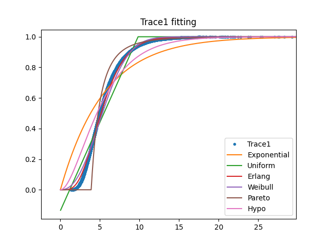
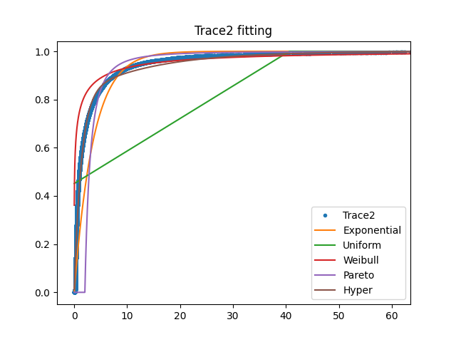

# Fitting
___

### Overview
The enclosed files [Trace1.csv](Trace1.csv) and [Trace2.csv](Trace2.csv) contain a single column that reports the service times of two different file servers.

---

### Results

### Trace1

#### ✔️ Mean: 5.4948

#### ✔️ Second Moment: 36.4073

#### ✔️ Third Moment: 294.3437

#### ✔️ Variance: 6.2141

#### ✔️ Coefficient of Variation: 0.4537

#### ✔️ Fit to Uniform Distribution: Min: 1.1771, Max: 9.8125

#### ✔️ Fit to Exponential Distribution: Rate: 0.1820

#### ✔️ Fit to Erlang Distribution: Stages: 5, Rate: 0.9099

#### ✔️ Fit to Weibull Distribution: Scale: 6.2009, Shape: 2.3419

#### ✔️ Fit to Pareto Distribution: Shape: 3.4197, Scale: 3.8888

#### ✔️ Fit to Two-Stage Hyper-Exponential Distribution: First Rate: 0.1810, Second Rate: 0.1820, Probability 1: 0.0010

#### ✔️ Fit to Two-Stage Hypo-Exponential Distribution: First Rate: 0.3635, Second Rate: 0.3645

---

### Trace2

#### ✔️ Mean: 3.6139

#### ✔️ Second Moment: 469.5959

#### ✔️ Third Moment: 941390.0074

#### ✔️ Variance: 456.5358

#### ✔️ Coefficient of Variation: 5.9124

#### ✔️ Fit to Uniform Distribution: Min: -33.3943, Max: 40.6221

#### ✔️ Fit to Exponential Distribution: Rate: 0.2767

#### ✔️ Fit to Erlang Distribution: Stages: 0, Rate: 0.0

#### ✔️ Fit to Weibull Distribution: Scale: 0.3231, Shape: 0.2880

#### ✔️ Fit to Pareto Distribution: Shape: 2.0175, Scale: 2.0185

#### ✔️ Fit to Two-Stage Hyper-Exponential Distribution: First Rate: 0.0726, Second Rate: 0.7515, Probability 1: 0.1834

#### ✔️ Fit to Two-Stage Hypo-Exponential Distribution: First Rate: 0.3953, Second Rate: 0.9224

---

### Graphs

#### ✔️ Empirical CDF Comparison
For each trace, draw a figure comparing the empirical CDF with the CDFs of the fitted distributions.

- **Trace1**
  

- **Trace2**
  

---

### Python Script

Python script that calculates all the above values and generates the graphs: [**A04.py**](A04.py)