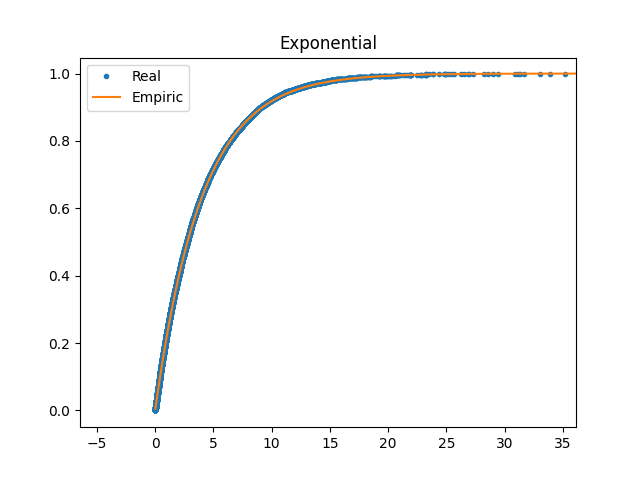
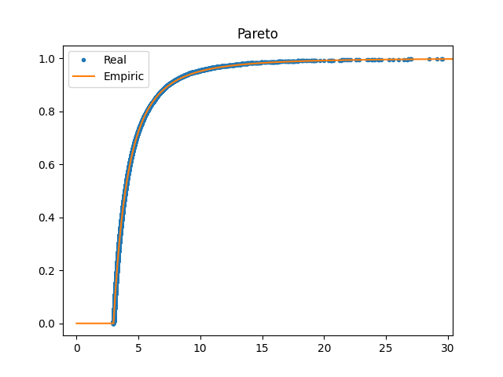
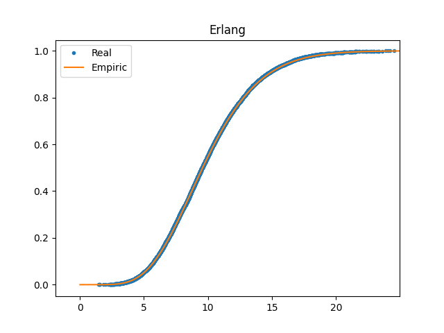
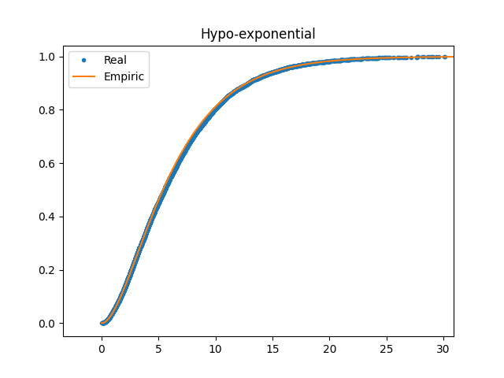
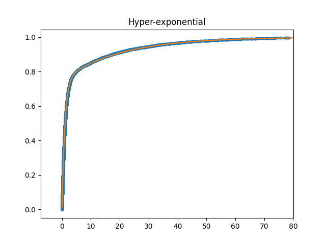

# Random Number Generation
___

### Overview
The goal is to generate random samples (N = 10000) for various distributions using a uniform random number generator and then compare the empirical distribution to the theoretical one. The distributions and parameters are as follows:

1. **Exponential Distribution**: λ = 0.25
2. **Pareto Distribution**: a = 2.5, m = 3
3. **Erlang Distribution**: k = 8, λ = 0.8
4. **Hypo-Exponential Distribution**: λ₁ = 0.25, λ₂ = 0.4
5. **Hyper-Exponential Distribution**: λ₁ = 1, λ₂ = 0.05, p₁ = 0.75

--- 

### Results

### Exponential Distribution
#### ✔️ Rate Parameter λ: 0.25
- **Empirical CDF**: The CDF derived from the generated samples is shown alongside the theoretical CDF.

---

### Pareto Distribution
#### ✔️ Shape Parameter a: 2.5
#### ✔️ Scale Parameter m: 3
- **Empirical CDF**: The CDF derived from the generated samples is shown alongside the theoretical CDF.

---

### Erlang Distribution
#### ✔️ Shape Parameter k: 8
#### ✔️ Rate Parameter λ: 0.8
- **Empirical CDF**: The CDF derived from the generated samples is shown alongside the theoretical CDF.

---

### Hypo-Exponential Distribution
#### ✔️ Rate Parameters λ₁, λ₂: 0.25, 0.4
- **Empirical CDF**: The CDF derived from the generated samples is shown alongside the theoretical CDF.

---

### Hyper-Exponential Distribution
#### ✔️ Rate Parameters λ₁, λ₂: 1, 0.05
#### ✔️ Probability p₁: 0.75
- **Empirical CDF**: The CDF derived from the generated samples is shown alongside the theoretical CDF.

---

### Python Script

Python script that calculates all the above values and generates the graphs: [**A05.py**](A05.py)