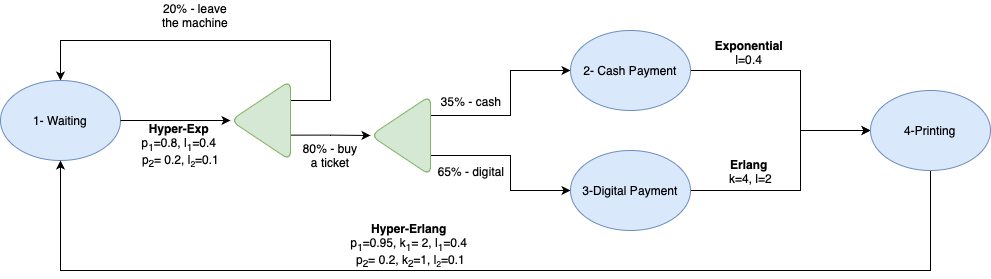

# Automatic Ticketing Machine Analysis

___

### Overview

This report examines an automatic ticket machine in a crowded area, where customers engage in ticket purchasing
transactions. A new customer is assumed to start their transaction immediately after the previous customer finishes. The
machine has the following stages of interaction:

1. Customer interaction with the Graphical User Interface (GUI).
2. Ticket purchase decision.
3. Payment process (cash or electronic).
4. Ticket printing.

The following analysis includes:

1. A state machine diagram for the transaction process.
2. Probabilities for each state (waiting for user input, cash transaction, electronic transaction, and printing).
3. The average duration of a transaction.
4. The expected cash collected over 20 hours of operation.

---

### Transaction Flow

| Stage                     | Description            | Distribution                          |
|---------------------------|------------------------|---------------------------------------|
| **A. GUI Time**           | Customer input         | 2-stage Hyper-exponential: p₁ = 0.8, λ₁ = 0.4, p₂ = 0.2, λ₂ = 0.1 |
| **B. Cash Payment**       | Cash transaction       | Exponential: λ = 0.4                  |
| **C. Electronic Payment** | Electronic transaction | Erlang: k = 4, λ = 2                  |
| **D. Printing**           | Ticket printing        | 2-stage Hyper-Erlang: p₁ = 0.95, k₁ = 2, λ₁ = 10, p₂ = 0.05, k₂ = 1, λ₂ = 0.1 |

### Ticket Fares

| Ticket Type | Fare (€) | Probability |
|-------------|----------|-------------|
| Urban       | 2.50     | 90%         |
| Area I      | 4.00     | 6%          |
| Area II     | 6.00     | 4%          |

---

### Results

#### 1. State Machine

A state machine diagram represents the interaction sequence and transition probabilities for each stage.

#### 2. State Probabilities

- **Waiting for User Input**: 63.58%
- **Cash Transaction**: 11.09%
- **Electronic Transaction**: 16.54%
- **Printing**: 8.79%

#### 3. Average Transaction Duration

The average duration for a transaction (in minutes) is computed based on the distributions of each stage.

- **Average Transaction Time**: 6.299 minutes

#### 4. Cash Collected Over 20 Hours

The average cash collected by the machine over a 20-hour period is calculated based on ticket fares and probabilities.

- **Total Cash Collected (20 hours)**: 145.39 €

---

### Python Script

Python script that calculates all the above values and generates the state machine diagram: [**A07.py**](A07.py)