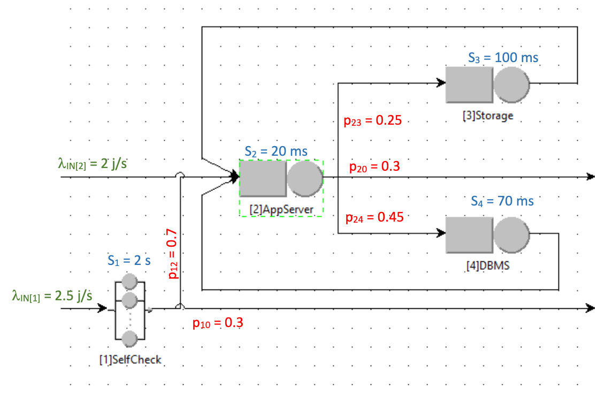

# Open Models Analysis
___

### Overview

This report analyzes the performance of a web application consisting of several components that work together to handle requests. The application comprises the following elements:

1. **Self-Check (Infinite Server)**
2. **Application Server**
3. **Web Server**
4. **DBMS (Database Management System)**

Each component is characterized by its average service time and specific routing probabilities, which impact the overall behavior of the system. This analysis aims to evaluate the performance of this multi-tier system by calculating visits, throughput, average jobs in the system, average response time, and maximum sustainable arrival rate.

The following analysis includes:

1. Visits of the application server, the storage, and the DBMS.
2. Throughput of the system.
3. Average number of jobs in the system.
4. Average system response time.
5. Maximum arrival rate the system would be able to handle.

---

### System Characteristics

- **Self-Check**:
  - **Arrival Rate (λ1)**: 2.5 jobs per second
  - **Service Time (S1)**: 2 seconds
  - **Probability to Application Server (p12)**: 70%
  - **Probability of Leaving the System (p10)**: 30%

- **Application Server**:
  - **Arrival Rate (λ2)**: 2 jobs per second
  - **Service Time (S2)**: 20 milliseconds
  - **Probability of Leaving the System (p20)**: 30%
  - **Probability to Storage (p23)**: 25%
  - **Probability to DBMS (p24)**: 45%

- **Storage**:
  - **Service Time (S3)**: 100 milliseconds

- **DBMS**:
  - **Service Time (S4)**: 70 milliseconds

  
---

### Results

#### 1. Visits

- **Application Server**: 2.778
- **Storage**: 0.694
- **DBMS**: 1.250

#### 2. Throughput

- **System Throughput (X)**: 4.5 jobs/s

#### 3. Average Number of Jobs in the System

- **Average Number of Jobs (N)**: 6.437

#### 4. Average System Response Time

- **Average Response Time (R)**: 1.431 s

#### 5. Maximum Arrival Rate

- **Maximum Arrival Rate**: 0.9 jobs/s

---

### Python Script

Python script that calculates all the above values: [**A12.py**](A12.py)