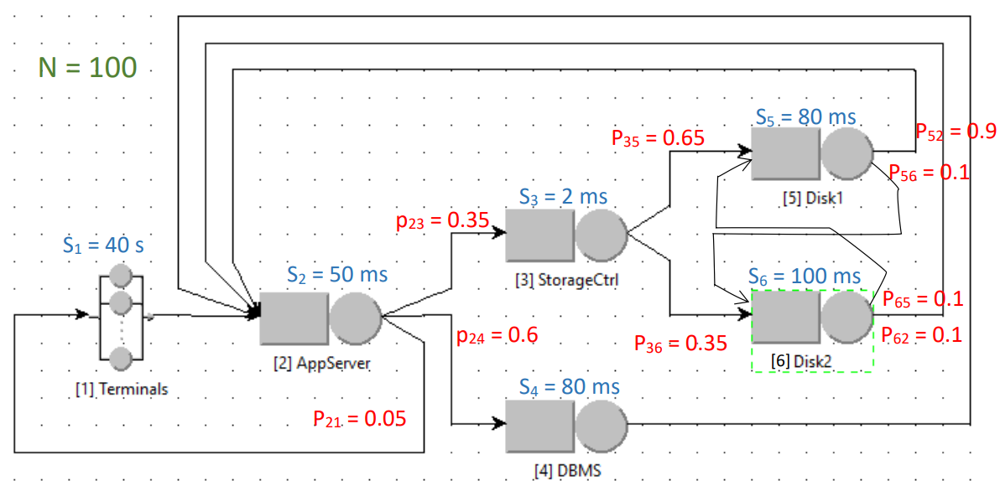

# Closed Model Analysis
___

### Overview

This report examines the performance of a closed network of a small company intranet used by 100 employees. Each employee generates requests to different components of the system, which include an Application Server, a Storage Controller, DBMS, and Disks. The system is analyzed using the Mean Value Analysis (MVA) technique, considering the system is separable.

The following analysis includes:

1. **The demand of the two disks**.
2. **The throughput of the system (X)**.
3. **The average system response time (R)**.
4. **The utilization of the Application Server, DBMS, Disk 1, and Disk 2**.
5. **The throughput of the two disks**.

--- 

### System Components and Flows

#### Components and Service Times:

- **N = 100**: Total number of employees (users).
- **Think Time (S1)**: 40 seconds per request.
- **Application Server (S2)**: Average service time of **50 ms**.
- **Storage Controller (S3)**: Average service time of **2 ms**.
- **DBMS (S4)**: Average service time of **80 ms**.
- **Disk 1 (S5)**: Average service time of **80 ms**.
- **Disk 2 (S6)**: Average service time of **100 ms**.

#### Routing Probabilities:

- **Application Server**:
  - **35%** of requests are routed to the **Storage Controller**.
  - **60%** of requests are routed to the **DBMS**.
  - **5%** of requests complete the job and return to users.

- **Storage Controller**:
  - **65%** of requests are routed to **Disk 1**.
  - **35%** of requests complete after being processed by the **Storage Controller**.

- **Disk 1**:
  - **10%** of requests are offloaded to **Disk 2**.
  - **90%** of requests complete after being processed by **Disk 1**.

- **Disk 2**:
  - **10%** of requests are offloaded to **Disk 1**.
  - **90%** of requests complete after being processed by **Disk 2**.

___

### System Diagram

--- 

### Results

The results of the Mean Value Analysis (MVA) technique provide insights into the demand, throughput, response time, and utilization for the different components in the system.

#### 1. Disk Demand
- **Demand on Disk 1**: _TBD_
- **Demand on Disk 2**: _TBD_

#### 2. System Throughput (X)
- **System Throughput**: _TBD_ requests per second

#### 3. Average System Response Time (R)
- **Response Time**: _TBD_ seconds

#### 4. Utilization of Components
- **Application Server Utilization**: _TBD_%
- **DBMS Utilization**: _TBD_%
- **Disk 1 Utilization**: _TBD_%
- **Disk 2 Utilization**: _TBD_%

#### 5. Disk Throughput
- **Throughput of Disk 1**: _TBD_ requests per second
- **Throughput of Disk 2**: _TBD_ requests per second

--- 

### Python Script

The Python script that performs the Mean Value Analysis and computes all the above values can be found here: [**A13.py**](A13.py)