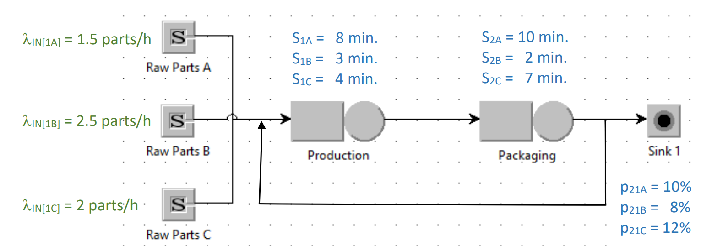

# Multi-class Open Models Analysis
___

### Overview

This report analyzes the performance of a production/packaging facility handling three types of products (three classes). Each product class has unique characteristics in terms of raw part arrivals, assembly, and handling times. During the packaging stage, defective products are sent back to the production stage with class-dependent probabilities.

The following analysis includes:

1. **Utilization of the two stations.**
2. **Average number of jobs in the system for each type of product (class c - Nc).**
3. **Average system response time per product type (class c - Rc).**
4. **Class-independent average number of jobs in the system (N).**
5. **Class-independent average system response time (R).**

---

### System Diagram

___

### Results

#### 1. Utilization of the Stations

- **Station 1 Utilization (U1)**: 0.5096
- **Station 2 Utilization (U2)**: 0.6335

#### 2. Average Number of Jobs in the System for Each Product Class

- **Class 1 (N1)**: 1.2111
- **Class 2 (N2)**: 0.5242
- **Class 3 (N3)**: 1.0325

#### 3. Average System Response Time per Product Type

- **Class 1 Response Time (R1)**: 48.4436
- **Class 2 Response Time (R2)**: 12.5812
- **Class 3 Response Time (R3)**: 30.9736

#### 4. Class-Independent Average Number of Jobs in the System

- **Average Number of Jobs (N)**: 2.7678

#### 5. Class-Independent Average System Response Time

- **Average System Response Time (R)**: 27.6776

---

### Python Script

Python script that calculates all the above values: [**A14.py**](A14.py)