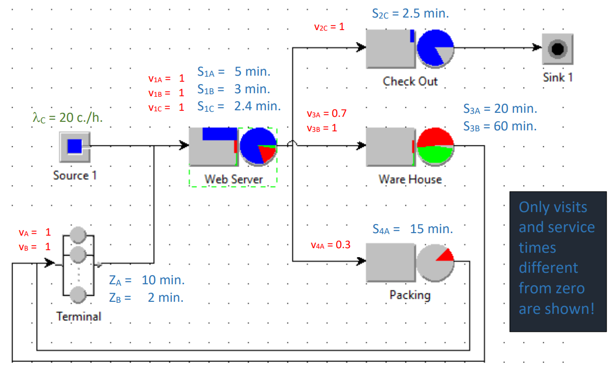

# Multi-class Mixed Models Analysis
___

### Overview

This report evaluates the performance of a warehouse management system handling orders from three types of users: **customers**, **employees**, and **maintainers**. Each class interacts with the system's resources—web server, checkout service, warehouse, and packing facility—with distinct usage patterns.

The analysis addresses the following performance metrics:

1. **Utilization of the four stations (excluding terminals).**
2. **Average number of users in the system for customers, employees, and maintainers.**
3. **Average number of users in the web server.**
4. **Average system response time for customers, employees, and maintainers.**
5. **Throughput of the warehouse.**
6. **Class-independent average number of jobs in the system (N).**
7. **Class-independent average system response time (R), excluding the think-time.**

---

### System Diagram

---

### Results

#### 1. Utilization of the Stations

- **Web Server Utilization**: 0.9999
- **Checkout Service Utilization**: 0.8333
- **Warehouse Utilization**: 0.8817
- **Packing Facility Utilization**: 0.1375

#### 2. Average Number of Users in the System per Class

- **Customers (N_c)**: 81.0724
- **Employees (N_e)**: 20.0000
- **Maintainers (N_m)**: 3.0000

#### 3. Average Number of Users in the Web Server

- **Web Server (N_ws)**: 94.0905

#### 4. Average System Response Time per Class

- **Customers (R_c)**: 243.2171
- **Employees (R_e)**: 535.4408
- **Maintainers (R_m)**: 540.6370

#### 5. Throughput of the Warehouse

- **Warehouse Throughput**: 0.0330

#### 6. Class-Independent Average Number of Jobs in the System

- **Average Number of Jobs (N)**: 104.0724

#### 7. Class-Independent Average System Response Time

- **Average System Response Time (R)**: 276.1343

---

### Python Script

Python script that calculates all the above values: [**A15.py**](A15.py)